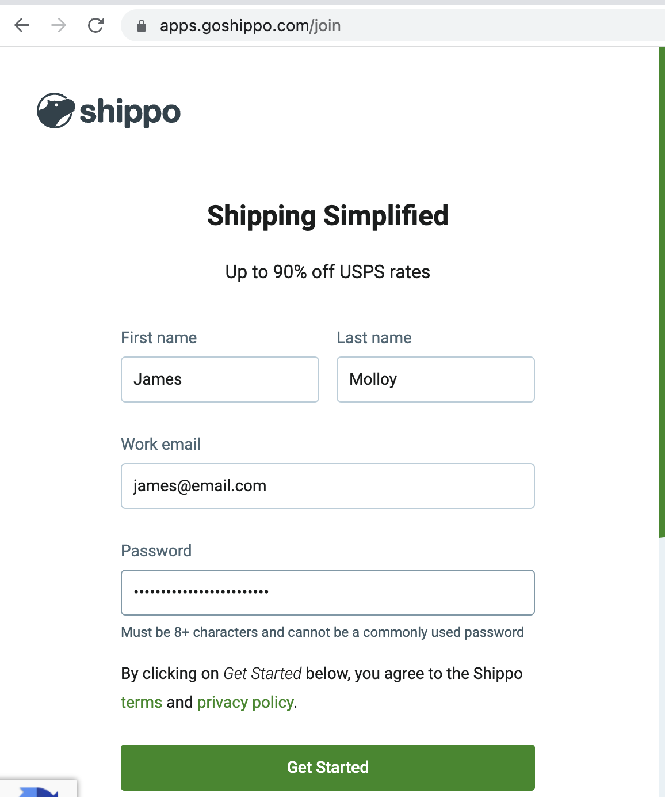
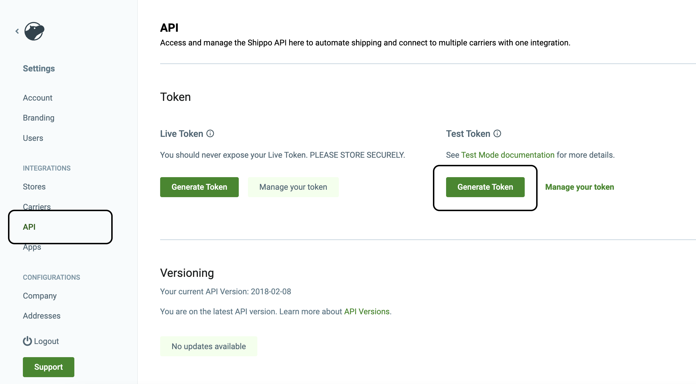

# Shippo API Quick Start Guide

Follow this guide learn everything you need to start using the Shippo API.


## 1. Create your free account
| Note: If you already have a Shippo account, skip ahead to Step 2. |
| --- |

In your browser, open the address [https://apps.goshippo.com/join](https://apps.goshippo.com/join). Enter your name, email, a secure password, and click **Get Started**.

Complete your registration by following the questions.




## 2. Generate your API test key
While logged into you Shippo account, in the left menu bar, click **Settings** followed by **API**. 

Under *Test Token*, click **Generate Token**. Copy your API Token and click **Done**.




| Note: Using your test token means all calls you make to the Shippo API are [free](https://goshippo.com/docs/test-mode/). |
| --- |

## 3. Install the client library for your language


```curl
    # cURL
    # No library needed for cURL
```
```python
    #Python
    pip install shippo
```
```Ruby
    #Ruby
    gem install shippo
```
```node
    // Node.JS
    npm install shippo
```
```PHP
    //PHP
    Follow the steps in the  [library repo](https://github.com/goshippo/shippo-php-client)
```
```Other
  //Other libraries
  //For a full list of supported libraries, review our client [libraries page](https://goshippo.com/docs/client-libraries/).
```

## 4. Make your first API call
To make sure everything is working, make a simple call to create a new address in your Shippo account.

You must replace '<API_TOKEN>' with the token you copied from Step 2.

```curl
 # cURL
 curl https://api.goshippo.com/addresses/ \
    -H "Authorization: ShippoToken <API_TOKEN>" \
    -d name="Shawn Ippotle" \
    -d company="Shippo" \
    -d street1="215 Clayton St." \
    -d street2="" \
    -d city="San Francisco" \
    -d state="CA" \
    -d zip=94117 \
    -d country="US" \
    -d phone="+1 555 341 9393" \
    -d email="shippotle@goshippo.com"\
    -d is_residential=True\
    -d metadata="Customer ID 123456"
```
```python
#Python
    import shippo
    shippo.config.api_key  = "<API_TOKEN>"  
 
    address_from = shippo.Address.create(
    name="Shawn Ippotle",
    company="Shippo",
    street1="215 Clayton St.",
    city="San Francisco",
    state="CA",
    zip="94117",
    country="US", # iso2 country code
    phone="+1 555 341 9393",
    email="shippotle@goshippo.com"
print 'Success with Address 1 : %r' % (address1, )
)
  
```
```Ruby
#Ruby
require 'shippo'
Shippo::API.token = '<API_TOKEN>'

# Create address object
address_from = Shippo::Address.create(
    :name => "Shawn Ippotle",
    :company => "Shippo",
    :street1 => "Clayton St.",
    :street_no => "215",
    :street2 => "",
    :city => "San Francisco",
    :state => "CA",
    :zip => "94117",
    :country => "US",
    :phone => "+1 555 341 9393",
    :email => "shippotle@goshippo.com"
)
```
```node
  // Node.JS
  // Create address object
var shippo = require('shippo')('<API_TOKEN>');
var addressFrom  = shippo.address.create({
    "name":"Shawn Ippotle",
    "company":"Shippo",
    "street1":"215 Clayton St.",
    "city":"San Francisco",
    "state":"CA",
    "zip":"94117",
    "country":"US", // iso2 country code
    "phone":"+1 555 341 9393",
    "email":"shippotle@goshippo.com",
})
```
```PHP
//PHP
require_once('lib/Shippo.php');
Shippo::setApiKey("<API_TOKEN>");

// Create address object
$fromAddress = Shippo_Address::create( array(
    "name" => "Shawn Ippotle",
    "company" => "Shippo",
    "street1" => "215 Clayton St.",
    "city" => "San Francisco",
    "state" => "CA",
    "zip" => "94117",
    "country" => "US",
    "phone" => "+1 555 341 9393",
    "email" => "shippotle@goshippo.com" 
));
```
```Other
  //Other libraries
  //For a full list of supported libraries, review our client libraries page https://goshippo.com/docs/client-libraries/.
```


If your request to create a new address was a success, the response should look like the following.
If you don't get a response like this, check your code and make sure your API token is correct.

```
{
   "is_complete": true,
   "object_created":"2022-07-09T02:19:13.174Z",
   "object_updated":"2022-07-09T02:19:13.174Z",
   "object_id":"d799c2679e644279b59fe661ac8fa488",
   "object_owner":"shippotle@goshippo.com",
   "validation_results": {},
   "name":"Shawn Ippotle",
   "company":"Shippo",
   "street_no": "",
   "street1":"215 Clayton St.",
   "street2":"",
   "street3":"",
   "city":"San Francisco",
   "state":"CA",
   "zip":"94117",
   "country":"US",
   "longitude": null,
   "latitude": null,
   "phone":"15553419393",
   "email":"shippotle@goshippo.com",
   "is_residential":true,
   "metadata":"Customer ID 123456"
}
```

## 5. Next Steps
You now know how to make API calls using the Shippo API. Your next step is to create your [first shipping label](https://goshippo.com/docs/shipping-labels/).
You can also start exploring our API reference to learn about all the Shippo API features.